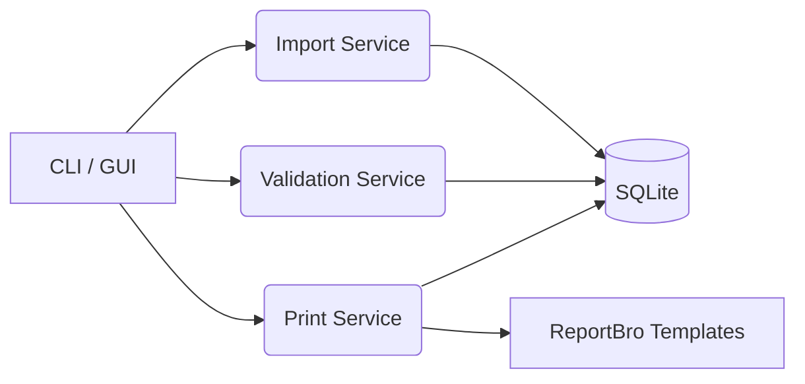

# ARCHITECTURE — Visão Geral

## Camadas
- **CLI/GUI**: comandos `import`, `validate`, `print`; (GUI na fase 2).
- **Services**: importação, validação, impressão, resolução de códigos.
- **Data**: repositórios SQLite, migrações, backups.
- **Reporting**: templates ReportBro e/ou geração programática (PIL + reportlab opcional).

