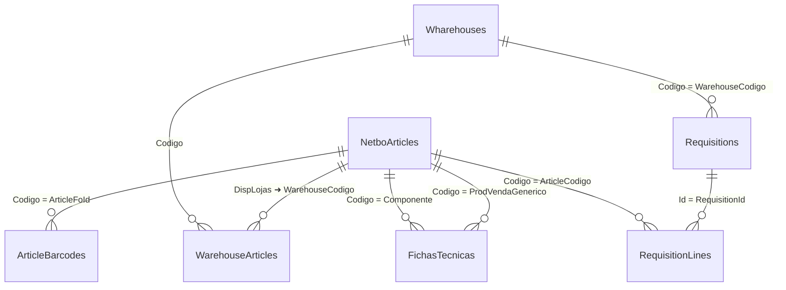

# DATA MODEL — Esquema de Base de Dados (SQLite)

## Tipos de tabelas
- **Tipo 1 (Importadas)**: Conteúdo só pode ser alterado por **reimportação**.
  - `NetboArticles`, `Wharehouses`, `ArticleBarcodes`, `FichasTecnicas`
- **Tipo 2 (Internas)**: Utilização normal (CRUD pela app).
  - `Requisitions`, `RequisitionLines`, `Settings`, `WarehouseArticles` (normalizada), `ImportsLog`

> **PascalCase** para todos os nomes de tabelas e colunas.

---

## Tabelas Tipo 1 (Importadas)

### `NetboArticles`
| Campo | Tipo | Notas |
|---|---|---|
| Codigo | TEXT PRIMARY KEY | Código do artigo |
| Produto | TEXT | Nome |
| Familia | TEXT |  |
| SubFamilia | TEXT |  |
| CodBarras | TEXT | Código de barras base |
| AfetaStock | INTEGER | 0/1 |
| Menu | INTEGER | 0/1 |
| Venda | INTEGER | 0/1 |
| Mercadoria | INTEGER | 0/1 |
| Producao | INTEGER | 0/1 |
| Generico | INTEGER | 0/1 |
| Intermedio | INTEGER | 0/1 |
| Servico | INTEGER | 0/1 |
| Unidade | TEXT |  |
| UnVenda | TEXT |  |
| UnInventario | TEXT |  |
| UnProducao | TEXT |  |
| CodAuxiliar | TEXT |  |
| CodAuxiliar2 | TEXT |  |
| Pcu | REAL |  |
| Pcm | REAL |  |
| Descontinuado | INTEGER | 0/1 |
| QtdNegativasNasCompras | INTEGER | 0/1 |
| ControlaNumerosDeSerie | INTEGER | 0/1 |
| DispLojas | TEXT | Ex.: `10001, 10002` |
| PesoTransporte | REAL |  |
| Markup | REAL | Percentagem |
| TipoDeProdutoSaftPsoie | TEXT | Enum `P,S,O,I,E` |

**Observação:** `DispLojas` define relação N:N com `Wharehouses` (ver `WarehouseArticles`).

---

### `Wharehouses`
| Campo | Tipo | Notas |
|---|---|---|
| Codigo | TEXT PRIMARY KEY | **Extraído** de `Nome` (ver `IMPORT_SPEC.md`) |
| Tipo | TEXT | Loja/Armazém ou similar |
| Nome | TEXT | Texto completo do Excel (inclui `(#12345)`) |
| Nif | TEXT |  |
| TipoFo | TEXT |  |
| Teclado | TEXT |  |
| EmailDoResponsavel | TEXT |  |

---

### `ArticleBarcodes`
| Campo | Tipo | Notas |
|---|---|---|
| Id | INTEGER PRIMARY KEY AUTOINCREMENT | |
| ArticleFoId | TEXT | FK lógico para `NetboArticles.Codigo` |
| ArticleName | TEXT | |
| Barcode | TEXT | |
| UnitId | TEXT | |
| UnidadeName | TEXT | |
| Price | REAL | |
| StoreNames | TEXT | nomes de lojas |
| BrandNames | TEXT | |
| ZoneNames | TEXT | |

---

### `FichasTecnicas`
| Campo | Tipo | Notas |
|---|---|---|
| ProdVendaGenerico | TEXT | Código do artigo de venda/genérico |
| Componente | TEXT | Código do artigo componente |
| Quantidade | REAL | Quantidade necessária na ficha |
| Unidade | TEXT | Unidade de medida |
| NomeProdVendaGenerico | TEXT | Nome original do produto (quando disponível) |
| NomeComponente | TEXT | Nome original do componente (quando disponível) |

---

## Tabelas Tipo 2 (Internas)

### `WarehouseArticles`
Normaliza a relação N:N entre `NetboArticles` e `Wharehouses` com base em `DispLojas`.

| Campo | Tipo | Notas |
|---|---|---|
| WarehouseCodigo | TEXT | FK para `Wharehouses.Codigo` |
| ArticleCodigo | TEXT | FK para `NetboArticles.Codigo` |
| PRIMARY KEY (`WarehouseCodigo`, `ArticleCodigo`) | | |

### `Requisitions`
| Campo | Tipo |
|---|---|
| Id | INTEGER PRIMARY KEY AUTOINCREMENT |
| WarehouseCodigo | TEXT NOT NULL |
| CreatedAt | TEXT NOT NULL DEFAULT (datetime('now')) |
| Status | TEXT DEFAULT 'draft' |

### `RequisitionLines`
| Campo | Tipo |
|---|---|
| Id | INTEGER PRIMARY KEY AUTOINCREMENT |
| RequisitionId | INTEGER NOT NULL |
| ArticleCodigo | TEXT NOT NULL |
| Produto | TEXT |
| Quantidade | REAL NOT NULL DEFAULT 0 |
| Unidade | TEXT |
| Barcode | TEXT | Resolvido por política (ver `PRINT_SPEC.md`) |

### `Settings`
Pares chave/valor para parametrizações (ex.: unidade padrão, política de barras, layout).

| Campo | Tipo |
|---|---|
| Key | TEXT PRIMARY KEY |
| Value | TEXT |

### `ImportsLog`
Regista cada importação (ficheiro, hash, contagens, avisos).

| Campo | Tipo |
|---|---|
| Id | INTEGER PRIMARY KEY AUTOINCREMENT |
| When | TEXT |
| File | TEXT |
| Kind | TEXT | 'articles' | 'warehouses' | 'barcodes' | 'fichas_tecnicas' |
| Rows | INTEGER |
| Notes | TEXT |

---

## Relações (Mermaid)

